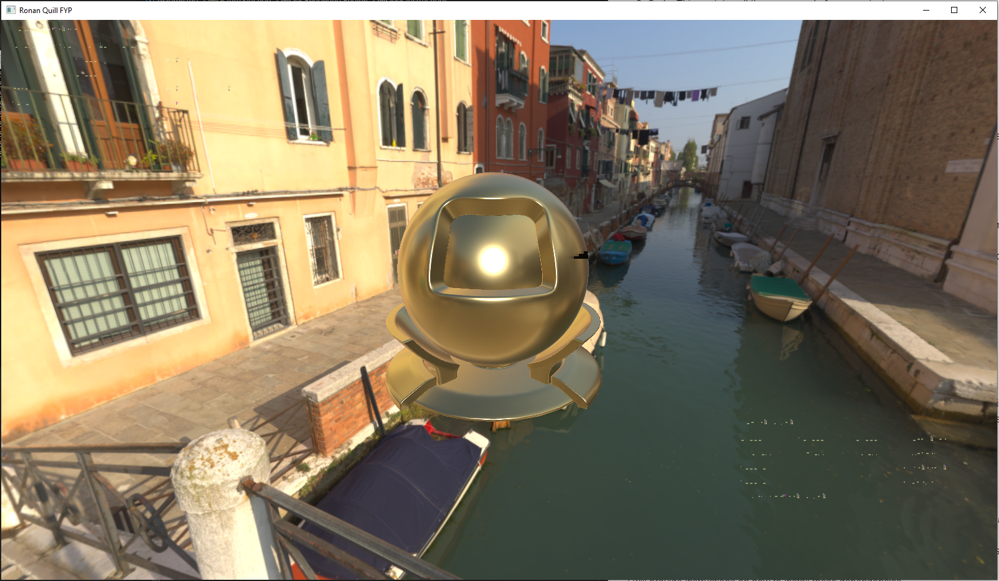

# Rónán Quill - FYP

# Introduction

In this folder you will find two directories

1) Rendering Engine: This contains a prebuilt version of my code for 64 bit windows machines.  
2) Code: This contains all the source code for my project.

## Rendering Engine

### Requirements

- 64 bit Windows 10 (Theorectically this should work on 64 bit linux machines but this has not been tested)
- Vulkan capable GPU (I developed this project on a GTX 1060 3GB and have tested it on a GTX 1050)
  - Please ensure your graphics drivers are up to date

### Instructions

1) To run the project, lauch "Rendering Engine/Rendering Engine.exe"
    - Start up times can take up to 1 minute depending on your system as 2GB of assets need to be loaded for the various scenes.

Unfortunately there appears to be a bug within the UI library I use and the program may not start correctly on the first attempt.
If you see the following when you launch the program please restart the program and try again. It usually works after 1 attempt but occasionally it can take multiple attempts. This bug is only present at start up.

#### UI Library Bug (Requires program restart)



#### Correct startup


### Controls

```
F1 - PBR Demo Scene (Default scene)
    1 - Alternate preset camera angle (Useful for view environment lights effects on materials)

F2 - Transparency Demo Scene
    1 - Alternate preset camera angle (View of 3 transparent spheres lined up)

F3 - Sponza Castle (262,249 Triangles, 182,297 Vertices, 100 Dynamic Points Lights)
    1 - Alternate preset camera angle (Close up of curtain, good oppurtunity to toggle ambient occlusion to see the effect)

F4 - Amazon Bistro (1,043,077 Triangles, 815,228 Vertices, 3 Dynamic Points Lights)
    1 - Alternate preset camera angle (Close up of wine bottle holder, another good oppurtunity to toggle ambient occlusion to see the effect)

F5 - Rungholt (6,704,264 Triangles, 13,408,530 Vertices, 10,000 Dynamic Points Lights)

W - Move camera forward
A - Move camera left
S - Move camera back
D - Move camera right

Right Mouse Button + Mouse Move - Rotate camera

Please note that this program does not support resizing or minimizing the window, if either of these events take place it will require a program restart.
```

## Code

### Requirements

- 64 bit Windows 10 (Theorectically this should work on 64 bit linux machines but this has not been tested)
  - Please ensure you have updated to the latest version of windows.
- Microsoft Visual Studio 2019 (This compiler is needed as I set a custom stack size)
- Vulkan capable GPU (I developed this project on a GTX 1060 3GB and have tested it on a GTX 1050)
  - Please ensure your graphics drivers are up to date

### Build Instructions
#### Dependencies
This project requires quite a few external libraries to implements keys features such as image file loading and the UI  
Managing packages in C++ can be quite painful so to overcome this I used Microsofts vcpkg package manager (https://github.com/microsoft/vcpkg)


#### Steps
1) Install vcpkg according to this link (https://github.com/microsoft/vcpkg#quick-start-windows)

2) Set the correct VCPKG_DEFAULT_TRIPLET for your system so that dependent projects are built correctly.
For 64 but windows set the following environment variable
```
set VCPKG_DEFAULT_TRIPLET=x64-windows
```

3) Install the Vulkan SDK version 1.2.162-1 (https://vulkan.lunarg.com/sdk/home#sdk/downloadConfirm/1.2.162.1/windows/VulkanSDK-1.2.162.1-Installer.exe)

4) Set the VULKAN_SDK environment variable to the install location of the the vulkan SDK
In my case this is:
```
set VULKAN_SDK=F:/VulkanSDK/1.2.162.1
```

5) Install the required dependencies using command prompt
```
PATH_TO_VCPKG/vcpkg install glm
PATH_TO_VCPKG/vcpkg install glfw3
PATH_TO_VCPKG/vcpkg install imgui
PATH_TO_VCPKG/vcpkg install imgui[glfw-binding]
PATH_TO_VCPKG/vcpkg install vulkan-memory-allocator
PATH_TO_VCPKG/vcpkg install stb
PATH_TO_VCPKG/vcpkg install devil
```

6) Copy the required assets into the source directory (these are not provided by default to reduce the file size for submission)
```
copy the folder "Rendering Engine/Scenes" to "Code/Rendering Engine"
copy the folder "Rendering Engine/Textures" to "Code/Rendering Engine"
```

7) Compile the GLSL shaders
```
Run "Code/Rendering Engine/Shaders/auto-compile.bat"
This will build all the required GLSL files.
```

8) Open "Code/Rendering Engine.sln" to open the project in Visual Studio
9) Build the project in either Debug or Release mode with x64 set as the "Solution Platform" 

This is quite a complicated build process so please do not hesitate to contact me for help at ronanquill96@gmail.com.  
I would be happy to arrange a zoom call or similar to walk you through the build process if needed.