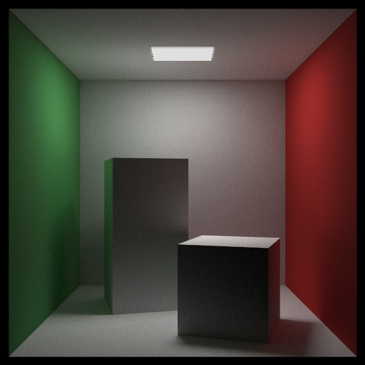
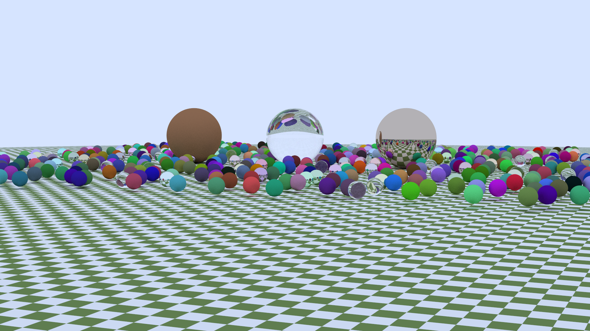

# Portfolio
Thank you for visiting my GitHub  portfolio.   

This is portfolio containing some of my personal projects with a focus on C++ and computer graphics.

I can be contacted at RonanQuill96@gmail.com to discuss any opportunities that you have availabel.  

# Portfolio Breakdown

### How to build a project
1) Clone this repository
2) Each folder contains a ".sln" file which can be opened in Microsoft Visual Studio 2019.
3) Compile with C++17 enabled.

### SIMD Math Library
A basic SIMD math library which contains implementations of a 4D Vector, 4x4 Matrix and associated methods.
This library also contains a basic test suite to ensure correct functionality.

### Thread Pool 
A lightweight header only C++ thread pool to allow easy use of thread pool.

### Software Based Ray Tracer 
A software based ray tracer created with C++ which renders individual frames of a provided scene. This is a basic ray tracer developed to familiarise myself with the techniques used when created ray tracing software.
The ray tracer is multithreaded through the use of my C++ thread pool library and also makes use of the previously mentioned SIMD library to improve performance.
##### Examples of rendered images.
###### Example 1: Dimensions: 600 x 600. Samples Per Pixel: 10,000

###### Example 2: Dimensions: 1920 x 1080. Samples Per Pixel: 100

### FYP Interim Report
This is the interim submission of my undergraduate thesis which details the implmentation and theory for my Vulkan 3D rendering engine.